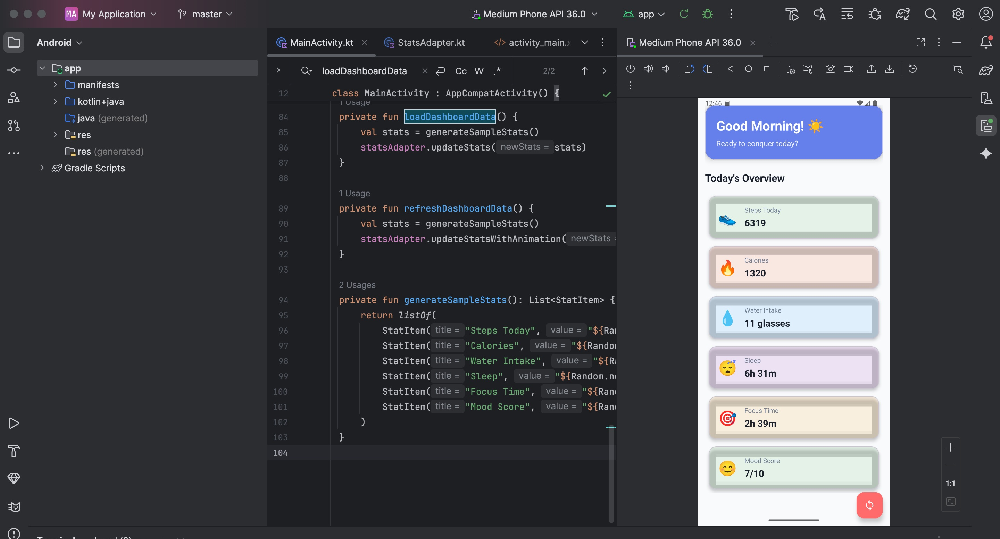

# 📊 Kotlin StatsApp – Personal Dashboard  

A **beautiful Android app example** built with **Kotlin** that showcases modern **Material Design 3 styling**, **smooth animations**, and a **personal dashboard** interface.  
This project demonstrates how to create engaging user experiences using **RecyclerView**, **Material Components**, and **ValueAnimator**.  

---

## Dashboard 

## 🎨 Design Highlights  

- Modern **Material Design 3** with gradients and rounded corners  
- **Dynamic color theming** with vibrant accents  
- **Glassmorphism-inspired** card designs (subtle transparency, shadows)  
- Contemporary typography with **Inter** font  

---

## ✨ Interactive Features  

- Smooth **staggered entrance animations** for stat cards  
- **Pulse animation** when refreshing data  
- Floating Action Button (**FAB**) with **scale click animation**  
- Gesture-friendly **ripple effects** on cards  
- Animated **refresh icon** (`ic_refresh`) with multiple styles  

---

## 🏗️ Architecture  

- **Kotlin + AndroidX**  
- **RecyclerView** for efficient scrolling  
- **ViewHolder pattern** for clean UI binding  
- **Data classes** for state management  
- **Coroutines-ready** for future async data loading  
- **MaterialCardView** with dynamic backgrounds  

---

## 📊 Dashboard Features  

- Personal **health & productivity metrics**  
- Emoji-based **iconography** for instant recognition  
- **Real-time updates** with visual feedback  
- Responsive design for different screen sizes  
- Optional **dark mode** support  

